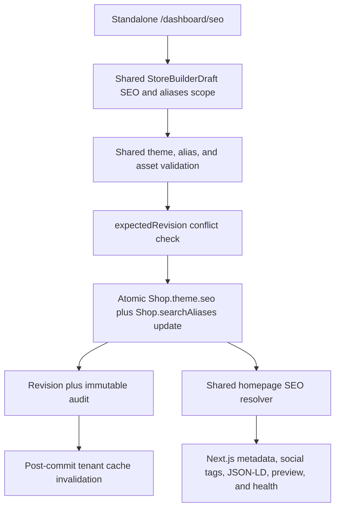

# Homepage SEO Architecture

## Data Flow



The framework-independent resolver is `packages/storefront-theme/homepage-seo.cjs`. It has no React, Next.js, Express, Mongoose, request, or browser dependency. The storefront and admin import adapters from the same package, so preview and live metadata use identical resolution rules.

## Resolution Priority

Each field resolves independently:

1. A manual vendor value.
2. A vendor-approved AI value copied into the draft.
3. A deterministic generated value.
4. Visible hero or store content.
5. The authoritative verified domain as a final identity fallback.

AI suggestions remain under `theme.seo.aiSuggestion`. Generating suggestions never changes published metadata. Applying an option copies selected fields into the local Store Builder draft; Publish is still required.

The homepage metadata adapter returns `title: { absolute: resolvedTitle }`. This intentionally bypasses the root `%s | Scaleup` template when the homepage title is already complete.

## Theme Contract

The SEO contract supports:

- `mode`: `auto` or `manual`.
- `siteName`, `title`, and `description`.
- `topics`, with legacy `keywords` normalized into the same list.
- `socialTitle`, `socialDescription`, and an uploaded social image URL.
- Social asset ID, alt text, real width, height, and MIME type.
- Search visibility and Google verification.
- BCP 47 language values currently limited to `en`, `bn`, `en-BD`, and `bn-BD`.
- British or American spelling preference.
- AI alternatives, accepted fields, timestamps, and a deterministic input hash.

Old themes continue to normalize. No existing SEO field is deleted. `topics` are guidance for content analysis and AI; the storefront does not emit a meta-keywords tag.

## Standalone Dashboard State

`/dashboard/seo` is lazy-loaded and uses URL-addressable tabs through `?tab=` plus optional `field` and `issue` query values. The page keeps separate published and draft SEO/alias baselines, a shared storefront revision, save/publish status, AI state, diagnostics, and conflict state. Debounced autosave changes only the shared draft record; it never publishes.

Store Builder now shows a compact SEO health card linking to this route. On browser focus it checks the SEO bootstrap revision. A dirty Store Builder draft is preserved and marked conflicted when another tab publishes; a clean builder may safely reload the newer published state.

## Focused APIs

| Route | Behavior |
| --- | --- |
| `GET /api/store-builder/admin/seo/bootstrap` | Returns published and draft SEO/aliases, revision, resolved metadata, health, capability/domain context, and owned social asset metadata. |
| `PUT /api/store-builder/admin/seo/draft` | Debounced save of only `theme.seo` and `searchAliases` into the shared Store Builder draft. |
| `DELETE /api/store-builder/admin/seo/draft` | Removes the SEO-only draft or rebases that scope while preserving unrelated Store Builder draft changes. |
| `POST /api/store-builder/admin/seo/publish` | Publishes SEO and aliases together with `expectedRevision`; unrelated theme, domain, and discount state is preserved. |

All routes reuse Store Builder authentication, `storeBuilder` permission, feature, tenant, rate-limit, and verification-suspension controls.

## Canonical And Indexing Rules

Canonical origin priority is:

1. Fully verified custom domain, preserving the exact stored `www` or apex host.
2. Stored platform subdomain.
3. Configured safe platform domain.

Arbitrary production `Host` headers are not canonical inputs. Localhost hosts are accepted only for local development. Store visibility, platform publication state, and vendor search visibility are combined into the effective robots value. Vendor visibility off remains `noindex, follow`; blocked or unpublished stores can be `noindex, nofollow` through platform state.

Sitemap and robots routes use fresh tenant bootstrap reads and the same canonical helper. Publishing invalidates only the affected tenant's settings/bootstrap and domain cache entries.

## Structured Data

The homepage emits connected, stable entities:

- `WebSite` at `/#website`, using the preferred Google site name.
- `OnlineStore` at `/#store`, using the official vendor-configured store name.

Approved spelling aliases may appear as `alternateName`, but they never replace official branding. Public logo, social image, public contact, currency, service area, and valid HTTPS social profiles are included only when available. `SearchAction` is omitted because the current storefront does not expose a stable server-addressable public search route.

JSON-LD is serialized with `<` escaped to prevent script termination through stored content.

## Social Images

New social images are uploaded through Store Builder and registered as tenant-owned assets. Publish verifies asset ID, URL, shop ownership, and usable asset status, then promotes the temporary asset as part of the existing publish lifecycle. Cross-tenant or mismatched asset references are rejected.

Open Graph image width, height, and MIME type are emitted only when the upload provider returned those values. The original image is not destructively transformed. A future Cloudinary 1200 x 630 derived asset can be added without changing the resolver contract.

## AI Safety And Freshness

The backend queries only products matching the shared public-product filter: tenant-owned, active, published, and not deleted. Active tenant collections are also bounded. The AI context excludes order/customer data, buying prices, private notes, and internal product fields.

Catalog text is stripped of HTML/control characters, length-limited, enclosed in `<store_data>`, and explicitly treated as untrusted reference data. Gemini must return JSON; output is parsed, normalized, length-limited, and stripped of unsafe claims. The official brand spelling is restored deterministically if the provider changes it.

Freshness hashes contain stable identity and content inputs such as official name, hero content, primary category, sorted active collections/categories, language, currency, and topics. Prices, stock, reviews, timestamps, and random ordering are excluded. Changed stable fields produce `possibly-outdated`; suggestions are never regenerated automatically.

## Search Identity

```text
User searches "ADI Jewelry"
        |
        v
Normalize Unicode, case, punctuation, and whitespace
        |
        v
Official name and approved aliases
        |
        v
Controlled regional spelling variants
        |
        v
Rank official exact, alias exact, official prefix, alias prefix, synonym
        |
        v
Return and display official "ADI Jewellery"
```

Aliases are top-level shop identity data, not SEO topics. They are limited, deduplicated, tenant-safe, and rejected when they contain URLs, phone numbers, keyword phrases, unrelated generic text, or another active store's exact official name. Plain MongoDB is currently used, so matching is bounded to indexed prefix and controlled spelling variants; broad fuzzy typo matching should use Atlas Search rather than an in-process full-dataset distance scan.

## SEO Health

Health output contains an overall score, indexability, group scores, and stable checks. Manual, AI-approved, generated, fallback, missing, invalid, warning, and blocked states receive different treatment. A noindex homepage is capped below the optimized threshold.

Checks cover content quality, title/description guidance, visible H1 relevance, active collections, internal links, image-alt coverage, canonical HTTPS, social image metadata/ratio/alt, structured data, social profiles, Search Console verification, sitemap origin, and metadata freshness. Character lengths and image ratio are guidance, not claims about fixed Google limits.

## Audit And Revision Behavior

SEO publish creates a normal Store Builder revision with `changeScope: homepage-seo`, a complete theme snapshot, and the corresponding search aliases. Shop update, revision creation, audit creation, and draft rebase/cleanup share the Mongo transaction where supported. A restore of an SEO-scoped revision restores only that historical SEO plus its aliases over the current unrelated storefront settings and creates a new immutable revision.

SEO AI generation adds a safe audit event containing only the alternative count, fallback flag, and deterministic input hash. Accepted suggestion provenance is stored in the draft and becomes part of the published revision only after Publish. Full prompts are not stored.

If another Store Builder or SEO tab publishes first, the stale request receives HTTP `409` with `code: THEME_CONFLICT`, latest revision, and publication time. The browser keeps local draft values and requires an explicit rebase or discard decision; it never silently retries a stale publish.

## Environment And Operations

- `GEMINI_API_KEY`: enables Store Builder SEO suggestions on the backend only.
- `GEMINI_MODEL`: optional model override.
- `GEMINI_TIMEOUT_MS`: optional provider timeout.
- `NEXT_PUBLIC_PLATFORM_DOMAIN`: storefront platform-domain fallback.

No AI key is sent to the browser. Missing Gemini configuration returns a friendly disabled response.

## Migration

No destructive migration is required. Theme normalization maps old `seo.keywords` to `seo.topics` while retaining the legacy array. Existing external social-image URLs remain readable; newly managed images use the tenant asset registry. Existing shops get normalized search identity values the next time they are validated or published; a dedicated backfill can be used before marketplace-wide alias search is enabled for all legacy shops.

## Verification Commands

```bash
cd ecommerce-backend/backend && npm test
cd ecommerce-backend/backend && npm run test:integration:local
cd ecommerce-admin && npm run lint && npm run build
cd ecommerce-storefront && npm run lint && npm run build
git diff --check
```

Mongo integration tests require the repository's disposable replica-set test database. Do not point them at production data.
