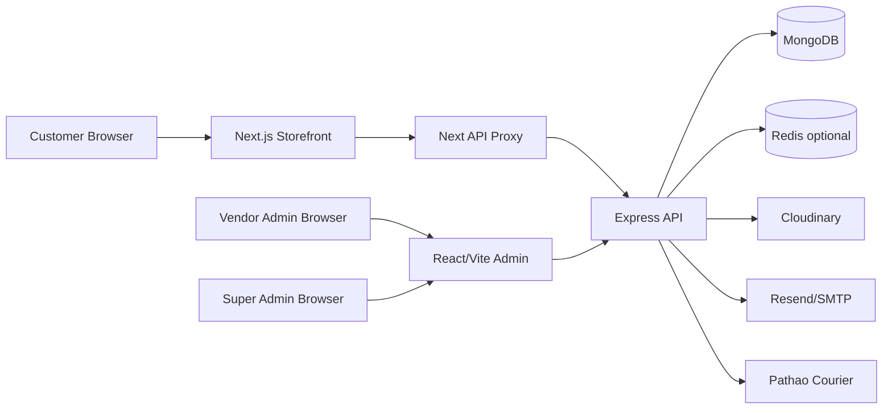
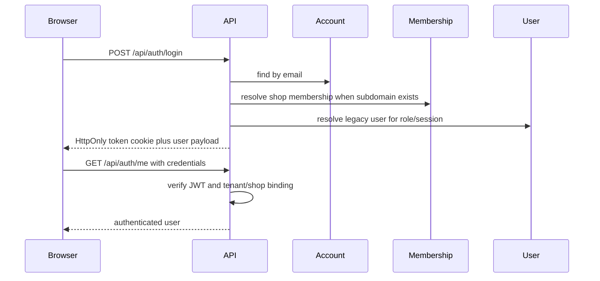

# Project Assessment Report

Project: ScaleUp / Shop-for-all multi-tenant e-commerce SaaS
Assessment date: 2026-06-18
Role: Lead Architect and Technical Consultant
Scope: Business model, architecture, database, backend, frontend, DevOps, security, scalability, cost, and future expansion.

Confidentiality note: Environment files were not read for secret values. This report references only variable names, code paths, and observable implementation patterns.

## 2. Executive Summary

Overall production readiness score: 6.6/10.

Launch recommendation: Do not launch as a public paid Shopify competitor today. Launch only as a controlled beta with trusted stores, tight operational monitoring, manual support, and a clear rollback path.

The project has moved beyond a simple marketplace prototype. It now includes multi-tenant shops, vendor/admin/customer identity work, product variants, order management, returns, promotions, Store Builder, Growth Center analytics, vendor verification, and Super Admin governance. The foundation is promising.

The main gap is not feature quantity. The main gap is production discipline: automated tests, inventory concurrency, privacy controls, deployment observability, CI/CD, background jobs, and clearer boundaries between legacy and long-term identity models.

| Area | Score | Summary |
|---|---:|---|
| Business model readiness | 7.0/10 | Good SaaS direction with plans, vendor verification, super-admin governance, and growth tooling. Billing automation is still incomplete. |
| System architecture | 7.2/10 | Clear three-app split with tenant-aware backend APIs. Needs stronger service boundaries and background jobs. |
| Database design | 7.0/10 | Good tenant keys, indexes, variants, orders, returns, and audit models. Dual User/Account compatibility is technical debt. |
| Backend | 7.3/10 | Strong tenant scoping in many controllers, validation, rate limits, and audit trails. Inventory concurrency and serverless packaging need work. |
| Frontend/admin UX | 6.6/10 | Broad feature set and modern Store Builder direction. StoreBuilder is too large and needs componentization plus regression tests. |
| Storefront UX/responsiveness | 6.8/10 | Shared storefront renderer and responsive product grid are improving. Product/cart/checkout still need full viewport QA. |
| Security | 6.7/10 | HttpOnly JWT cookies, RBAC, rate limits, NoSQL sanitization, and password reset hardening exist. CSRF, upload privacy, and health diagnostics remain risks. |
| Privacy/compliance | 5.5/10 | NID verification exists, but document access, retention, consent, and privacy policy enforcement need production-grade controls. |
| Infrastructure/DevOps | 4.8/10 | Vercel/Railway-style config exists, but no Docker, CI/CD pipeline, monitoring, backup, queue, or disaster recovery artifacts were found. |
| Scalability | 6.2/10 | Redis cache support, pagination, and indexes exist. Order writes, analytics growth, and cache invalidation need stronger architecture. |
| Future expansion | 7.4/10 | Theme sections, variants, Growth Center, verification, and super-admin modules provide a good base for Shopify-like growth. |

Top launch blockers:

1. Make checkout inventory updates atomic and idempotent.
2. Add automated regression coverage for auth, tenant isolation, checkout, Store Builder, and Super Admin.
3. Add monitoring, logs, backups, deployment pipeline, and incident runbooks.
4. Secure private NID document handling and define privacy/retention rules.
5. Split large frontend modules enough to make future changes safe.

## 3. Project Overview

Project type: Multi-tenant SaaS e-commerce platform similar to Shopify.

Problem being solved: Vendors can create their own online store, manage products/orders/customers, customize branding, and operate COD-based commerce from a hosted platform.

Primary users:
- Platform owner / Super Admin: governs shops, plans, abuse, domains, verification, announcements, and platform audit logs.
- Vendor Admin: owns a shop and manages catalog, orders, Store Builder, promotions, analytics, staff, shipping, verification, and settings.
- Vendor Staff: operates assigned areas based on permissions.
- Customer: shops on tenant storefronts, registers per shop, places orders, tracks orders, reviews products, and manages account/order history.

Geography: The implementation is Bangladesh-oriented today. Evidence includes BDT currency, COD checkout, Dhaka/outside Dhaka delivery pricing, Pathao courier integration, Banglish/Bengali ad copy options, and NID verification.

Business model assumptions from code:
- Subscription plans exist through Shop.plan and VendorPlan/Super Admin plan management.
- Commission and automated billing are not fully implemented in observed code.
- COD is the active payment path; online payment provider flags exist but live payment processing is not production complete.

## 4. Architecture Overview

Current high-level architecture:

Frontend architecture:
- Admin panel: React/Vite single-page app with lazy routes in `ecommerce-admin/src/App.jsx`.
- Storefront: Next.js tenant-subdomain app with middleware rewriting host subdomains to route segments in `ecommerce-storefront/src/middleware.js`.
- Storefront API access: browser calls `/api/*` through `ecommerce-storefront/src/app/api/[...path]/route.js`, which proxies to the backend and forwards cookies.
- Theme rendering: shared storefront components live in `ecommerce-storefront/src/components/storefront/ReferenceStorefront.jsx` and theme normalization in `ecommerce-storefront/src/lib/theme.js`.

Backend architecture:
- Express app with route modules and controller/model/service structure.
- MongoDB/Mongoose models are document-oriented and tenant scoped by `shop_id` on operational entities.
- Redis is optional through `ecommerce-backend/backend/services/cacheService.js`; fallback is in-process memory cache.
- Cloudinary is used for uploads.
- Resend/SMTP abstraction is used for email.
- Pathao service handles courier token/location/store/order calls.

Architecture strengths:
- Clear separation of admin, storefront, and API applications.
- Tenant resolution is explicit for storefront routes.
- Admin APIs use `protect`, role checks, and permission middleware.
- Storefront bootstrap reduces waterfall requests for core homepage data.
- Store Builder and storefront increasingly share theme normalization and renderer code.

Architecture weaknesses:
- Backend `app.js` connects DB and starts `app.listen()` directly while also exporting the app. This is simple for Railway but awkward for serverless and tests.
- No explicit queue/worker layer for email, analytics processing, courier sync, abandoned cart jobs, or notification fanout.
- Store Builder and ReferenceStorefront are very large files, increasing regression risk.
- Legacy `User` remains central while new `Account`, `ShopMembership`, and `CustomerProfile` coexist.

## 5. Database And Data Model Summary

Core tenant model:
- `Shop`: tenant root; owns theme, plan, domain, verification, feature flags, discount, and Pathao settings.
- `Account`: global login identity/person with unique email and password hash.
- `ShopMembership`: role inside a shop (`VendorAdmin`, `VendorStaff`, `Customer`), scoped by `shop_id` and `account_id`.
- `CustomerProfile`: shop-specific customer data and addresses.
- `User`: legacy compatibility user used heavily by auth, orders, reviews, and staff flows.

Commerce models:
- `Product`: tenant-scoped catalog entity with slug, SEO, media, options, variants, collections, pricing, stock, rating fields, and soft delete.
- `Order`: tenant-scoped order snapshot with customer, items, shipping, payment, pricing, status, and source.
- `InventoryLog`: stock movement audit trail for product/order/return/manual events.
- `ReturnRequest`: return/refund lifecycle with inventory restoration fields.
- `Promotion`: coupon/discount system with product/category/collection scoping, BOGO, usage limits, expiry, free shipping, and first-order concepts.
- `Review`: tenant and product scoped customer reviews with unique user/product constraint.
- `Collection`: product grouping support.

Platform/governance models:
- `VendorVerification`: NID verification per shop.
- `PlatformAuditLog`: Super Admin governance audit log.
- `AuditLog`: tenant audit log.
- `PlatformAnnouncement`: platform-wide announcement lifecycle.
- `AbuseReport`: governance/reporting workflow.
- `VendorPlan`: platform plan metadata.
- `Notification`: tenant notifications.
- `AnalyticsEvent`: public-safe analytics events for Growth Center.
- `AbandonedCart`: abandoned cart data model exists, but the end-to-end tracker/recovery flow appears incomplete.

Database strengths:
- Operational models consistently include `shop_id` and relevant indexes.
- Product variants are now enterprise-style, with option attributes, SKU, barcode, pricing, inventory, images, dimensions, status, and tax fields.
- Order items snapshot price, SKU, title, buying price, and attributes, preserving historical order integrity.
- Unique tenant scoped constraints exist for product slug, promotion code, reviews, and customer membership.

Database issues:
- Identity is split across modern and legacy models. Until the migration is fully completed, password, status, and role consistency must be carefully maintained.
- Order stock decrement uses read-modify-save patterns on Product variants. Under concurrent orders this can oversell.
- `AnalyticsEvent` has useful indexes, but growth can become expensive without TTL/retention, rollups, and partitioning strategy.
- NID document URLs are stored directly. Access control depends on where Cloudinary URLs are exposed, so private storage and retention policy are needed.

## 6. Authentication And Authorization

Authentication flow:

What works well:
- JWTs are in HttpOnly cookies, with secure and SameSite behavior adjusted by production mode.
- The auth middleware validates active account, legacy user, membership, and shop status.
- Customer reset requires shop/subdomain context, preserving tenant isolation.
- Password reset OTPs are hashed, time-limited, rate-limited, one-time use, and verified with constant-time comparison.
- Admin, staff, customer, and Super Admin flows are role-aware.

Authorization flow:
- `protect` verifies cookie/bearer token and attaches `req.user` and `req.tenantId`.
- `authorize()` restricts role-level access.
- `requirePermission()` checks staff permission documents first and falls back to legacy user permissions.
- Vendor verification guard blocks high-impact actions for verification-suspended shops.

Security gaps:
- Registration OTP model still stores plaintext OTP in `models/OTP.js`.
- Cookie-based auth should have explicit CSRF strategy for state-changing requests, especially because production cookies use `SameSite=None`.
- Password policy is strong for reset/update, but initial registration validation still allows minimum 6 characters.
- Some logging is noisy or exposes operational details. Remove debug `console.log` calls from order and Pathao flows.

## 7. Tenant Isolation Review

Tenant isolation strategy:
- Public storefront routes use `resolveTenant` based on route subdomain.
- Admin routes derive tenant from authenticated membership/token.
- Data models use `shop_id` as the tenant key.
- Storefront product, review, order, bootstrap, and batch-product queries include `shop_id` filters.
- Store Builder, products, orders, promotions, reviews, analytics, returns, and verification controllers largely query by `req.tenantId`.

Positive evidence:
- `middlewares/tenant.js` blocks inactive/suspended stores and verifies vendor verification deadline state.
- `middlewares/auth.js` rejects membership tokens that do not match requested tenant context.
- `routes/storefrontRoutes.js` puts `resolveTenant` before product, review, order, and tracking handlers.
- `controllers/storeController.js` filters bootstrap products/reviews/section data by `shop_id`.
- `controllers/publicController.js` resolves shop by subdomain before creating public/guest orders.

Remaining tenant risks:
- Dual legacy user/account architecture is inherently risky until fully migrated.
- Staff permission fallback to legacy `User.permissions` must be kept in sync with `StaffPermission`.
- Super Admin actions are intentionally cross-tenant; every dangerous action needs audit logs and reason capture.
- Public analytics accepts client-provided `customer_id`; it resolves shop server-side, but should verify customer belongs to that shop when storing authenticated customer IDs.

Tenant isolation score: 7.5/10.

## 8. Backend Review

Backend strengths:
- Modular routes/controllers/models/services.
- Request validation exists through Joi for users, orders, products, and password reset.
- Helmet, CORS allowlist/patterns, rate limits, cookie parser, and custom NoSQL operator sanitization are mounted in `app.js`.
- Storefront bootstrap consolidates core storefront data.
- Store Builder caches are invalidated after theme updates.
- Return/refund flow restores inventory and marks order returned/refunded.
- Super Admin hardening includes pagination, reason requirements, and audit logs.

Backend issues:
- `app.js` always calls `app.listen()`. Split app creation and server start for test/serverless friendliness.
- Checkout/order creation loops over items and saves Product documents one by one. This is an N+1 query pattern and a concurrency risk.
- Some external service calls have no retry/backoff/queue layer.
- Health endpoint returns mail diagnostics including sender addresses. Redact or restrict this in production.
- No API versioning or OpenAPI documentation is present.
- No centralized structured logger or request ID correlation was found.

Recommended backend changes:
1. Implement atomic stock reservation/decrement with conditional `$inc` and `arrayFilters`, or a separate Inventory collection keyed by variant.
2. Add queue-backed email/courier/analytics jobs.
3. Split `server.js` from `app.js`.
4. Add schema validation for Store Builder theme payloads, not only key-picking.
5. Add OpenAPI docs and contract tests for public/admin APIs.

## 9. Frontend And Admin Review

Admin strengths:
- Lazy routed React/Vite admin reduces initial bundle pressure.
- Sidebar now exposes regular navigation and role-specific routes.
- Vendor admin has broad coverage: dashboard, products, catalog tools, orders, returns, notifications, verification, promotions, Growth Center, analytics, Store Builder, staff, activity logs, shipping, settings.
- Super Admin routes are separate under `/super-admin`.
- Store Builder has live preview, device switching, undo/redo, publish/reset, dynamic sections, product selection, review selection, banner image upload, product card controls, and checkout branding.

Admin weaknesses:
- No admin test suite was found.
- `StoreBuilder.jsx` is about 2,962 lines. It should be split into data hooks, settings panels, preview shell, section editor, upload controls, and reducer/state helpers.
- Many workflows still rely on toast-only feedback; high-risk actions need confirmation and audit context.
- Accessibility needs formal keyboard/focus testing, especially for modals, sidebar, Store Builder controls, and Super Admin tables.

Storefront strengths:
- Next.js subdomain middleware supports tenant routing.
- API proxy forwards cookies and x-shop-subdomain headers.
- Product detail page supports variant selection, stock-aware quantity, gallery, reviews, related products, sticky mobile add-to-cart.
- Cart and checkout revalidate product details before order placement.
- Homepage uses a shared reference storefront renderer for products, banners, reviews, categories, filters, and responsive layout.

Storefront weaknesses:
- No storefront tests or responsive screenshot checks were found.
- Layout uses separate header/footer components plus shared ReferenceStorefront home; this is improving because header/footer now reuse reference components, but the architecture still needs guardrails against preview/live drift.
- Next image config allows any HTTPS hostname.
- Cart localStorage can contain stale UI data; backend protects price/stock, but UX should refresh stale cart items earlier.

## 10. Store Builder Review

Current Store Builder capabilities:
- Brand/logo upload and URL input.
- Header logo position and navigation with nested links.
- Colors, typography, layout spacing, product grid/card settings.
- Hero full-background banner slides with desktop/mobile image, title, subtitle, badge, discount text, primary/secondary CTAs.
- Dynamic homepage sections: Featured Products, Banner, Reviews, TextBlock, Newsletter, CategoryList.
- All Products fixed section controls.
- Product card styling controls: image fit, aspect, corners, shadow, title/price size, button style/shape/color, quick buy, wishlist, stock/SKU/reviews/badges.
- Checkout branding and policies.
- Mobile settings.
- Dynamic section add, duplicate, remove, enable/disable, lock, move up/down.
- Product search/category filter for Featured Products.
- Review picker for selected 5-star testimonials.
- Multiple banner images per dynamic banner section.
- Undo/redo, reset styling, publish changes, and unsaved indicator.

What works well:
- The theme schema is broad and future-ready.
- Storefront theme utilities normalize theme data consistently.
- Store Builder and storefront share `ReferenceStorefront` components for parity.
- Legacy banners are lazily migrated into dynamic sections by `themeSectionService.js`.

Limitations:
- The editor is still not a fully componentized visual editor like Shopify/Webflow.
- Store Builder state and UI are concentrated in one large file, creating maintainability risk.
- Theme payload validation is shallow on save; invalid nested theme structure can be stored if not blocked by Mongoose validators.
- Version history appears local/editor-level, not persisted as a true publish/draft/version collection.
- True draft publishing, rollbacks, and multi-theme library are not yet implemented.

Recommended next architecture:
- Add `ThemeVersion` model for drafts, published version, and rollback.
- Split Store Builder into modules: shell, preview, section editor, hero editor, product-card editor, checkout editor, theme reducer, upload hooks.
- Keep storefront as the source rendering layer, and treat the admin preview as a wrapper around it.

## 11. Security Audit

Security strengths:
- HttpOnly cookies for session token.
- Role and permission middleware.
- Tenant-aware auth binding.
- Rate limits for general, auth, public writes, and analytics.
- Helmet is enabled.
- NoSQL operator sanitization is enabled.
- Password reset flow is strong: hashed OTP, HMAC secret, TTL, resend wait, request limit, max attempts, generic response, constant-time comparison, one-time reset token.
- Upload file type and size limits exist.
- Super Admin dangerous actions require reasons.
- Platform audit log is separate from tenant audit log.

Security risks:
- Critical: order stock decrement is not atomic and can oversell under concurrent checkout.
- High: CSRF is not explicitly handled for cookie-authenticated state-changing APIs.
- High: NID uploads need private storage, retention, and access audit controls.
- Medium: `/api/health` exposes mail provider state and configured sender account names.
- Medium: Next.js image remote patterns allow `hostname: '**'`.
- Medium: registration OTP still stores plaintext OTP.
- Medium: analytics endpoint stores device/referrer/page data without consent/retention controls.
- Low: some logs include noisy debug output and operational details.

Recommended security fixes:
1. Add CSRF protection or double-submit token for cookie-auth write APIs.
2. Restrict and redact health diagnostics in production.
3. Convert registration OTP storage to hashed OTP records, or reuse `PasswordReset`-style service.
4. Store NID docs in private Cloudinary folders with signed access and retention policy.
5. Restrict Next image domains to Cloudinary and trusted asset hosts.
6. Add API security tests for IDOR and tenant boundaries across every controller.

## 12. Privacy, Compliance, Encryption, And Data Protection

Sensitive data currently handled:
- Customer names, emails, phone numbers, addresses, orders, cart data, reviews.
- Vendor owner/staff identity and NID document data.
- Password hashes and reset tokens.
- Analytics sessions, page URLs, referrers, device/browser/OS, UTM metadata.
- Courier credentials and Pathao account data.

What is good:
- Passwords are bcrypt hashed.
- Reset OTPs/tokens are hashed and TTL managed.
- JWT is HttpOnly cookie based.
- NID URLs are exposed only through owner/admin APIs in observed code.

Missing production controls:
- Published privacy policy for platform and vendors.
- Consent/notice for analytics tracking.
- Data retention policy for analytics, logs, NID, abandoned carts, and customer orders.
- NID encryption/private delivery controls.
- Backup encryption and restore testing evidence.
- Role-based access review procedure.
- Incident response and breach notification process.

Recommendation: Treat NID as high-risk personal data. Move it behind signed URLs, add access audit events, define retention, and hide/redact values wherever possible.

## 13. Storefront UX And Responsiveness

Storefront current state:
- Modern white/slate/teal Shopify-style visual direction.
- Responsive header, search, product grids, filters, product cards, banners, and footer in `ReferenceStorefront.jsx`.
- Hero/banner supports full-background slides, overlays, CTAs, service cards, arrows/dots, and mobile image selection.
- Product cards use responsive grid classes and full-width add-to-cart on narrow screens.
- Filter panel collapses to a mobile overlay.
- Footer stacks/accordions on narrow screens.

Remaining UX gaps:
- Needs viewport-by-viewport visual QA at 320, 360, 390, 430, 768, 1024, 1440, and 1920 widths.
- Product detail, cart, checkout, account, track order, and search need the same responsive polish as homepage.
- Trust signals should be consistent across product and checkout: COD, returns, secure checkout, delivery estimates, support.
- Cart and checkout should refresh stale product/variant data before user reaches final submit.
- Search currently fetches products on modal open; add debounced server search for large catalogs.

UX score: 6.8/10 now, with a credible path to 8/10 after systematic responsive QA and checkout polish.

## 14. Growth Center And Analytics

Current Growth Center capabilities:
- Public event model tracks product_view, add_to_cart, begin_checkout, order_placed, and search.
- Storefront tracker silently fails so shopping is not interrupted.
- Admin Growth Center shows overview metrics, product performance, product labels, search terms, recommendations, and product-aware ad helper.
- Ad helper uses product fields, metrics, campaign type, language, and order city history to suggest copy and audience guidance.

Advanced Analytics capabilities:
- Revenue, profit, average order value, sales by day/month, best sellers, returning customers, traffic source, abandoned carts count, low stock.
- Advanced analytics now counts revenue/profit only for Delivered orders.

Limitations:
- Growth Center revenue is event-based and can differ from delivered-order analytics unless reconciled.
- No retention/rollup strategy for AnalyticsEvent growth.
- No bot filtering or duplicate-event safeguards beyond session IDs.
- No external Meta/GA4/TikTok integration in current MVP, by design.
- AbandonedCart model exists, but full abandoned-cart capture/recovery flow appears incomplete.

Recommendation:
- Keep Growth Center as product funnel analytics.
- Keep Advanced Analytics as financial/order analytics based on delivered orders.
- Add daily rollup collections before 10,000+ stores.

## 15. Orders, COD, Courier, Returns, And Inventory

Order flow:
- Customer or guest submits checkout.
- Backend resolves shop and customer.
- Backend validates product, variant, stock, status, price, discount, promotion, shipping, and COD payment status.
- Order is created with item snapshots.
- Inventory logs are written.
- Vendor notification/email flow is triggered.

Good points:
- Backend recalculates prices and does not trust client totals.
- Orders snapshot variant/product details.
- Tenant filters are applied.
- Dedicated return flow can restore stock and mark order returned/refunded.
- Admin status route blocks direct Cancelled/Returned status updates and forces dedicated logic.
- Dashboard and Advanced Analytics use Delivered status for revenue/profit.

Critical concern:
- Stock decrement and restore are read-modify-save operations on product documents. Two concurrent checkouts can read the same stock before either save completes. Use atomic updates or a dedicated Inventory collection/reservation system.

Courier:
- Pathao service supports token, cities, zones, areas, store linking, and order sync.
- Pathao calls are synchronous and not queued. Failure/retry should be moved to a background job.

Returns/refunds:
- ReturnRequest supports statuses and refund metadata.
- Inventory restoration is guarded by `inventoryRestoredAt` idempotency field.
- Add financial reconciliation for refunded delivered revenue so analytics remain accurate.

## 16. Super Admin Overview

Super Admin current capabilities:
- Overview metrics and priority alerts.
- Shop list with pagination/search/filter/sort.
- Shop detail page with status, owner, plan, feature flags, verification, domain, abuse, and recent audit context.
- Manual shop status changes with reason requirement for suspension.
- Plan and feature flag updates.
- Vendor verification review: pending/rejected/approved/suspended/expired/deadline soon filters, approve, reject with reason.
- Platform audit logs.
- Domain status/admin note management through embedded Shop.customDomain.
- Failed payments list based on failed order payments.
- Announcement create/update/publish/unpublish/archive lifecycle.
- Abuse report list/detail/status workflow with reason requirements.

What works well:
- Governance actions are protected by SuperAdmin role.
- PlatformAuditLog is separate from tenant AuditLog.
- Manual suspension protection is designed to avoid accidentally clearing verification/manual suspensions.

What is missing:
- Super Admin sub-roles/permissions.
- Billing/subscription automation.
- Platform usage quotas enforcement.
- Domain DNS automation and certificate checks.
- Abuse evidence attachments and escalation workflow.
- Real payment failure/billing provider integration.
- Audit log export and immutable retention policy.

## 17. Notifications, Email, And AI

Notifications:
- Tenant notifications exist for orders, customers, returns, refunds, and system events.
- Notifications target VendorAdmin/VendorStaff users by shop.
- Notification service is fail-soft, which protects main workflows.

Email:
- Mail service abstracts Resend and SMTP.
- Sender selection supports reset, order, and admin mail types.
- Password reset template is professional and secure.
- Order emails and vendor notifications exist.

Email risks:
- Email sending is synchronous in request flows. Move to queue/retry for reliability.
- Health endpoint exposes configured sender metadata.
- Need bounced email tracking and suppression list for production.

AI:
- Product description generation uses Gemini in product controller.
- Growth Center ad helper is rule-based, avoiding external AI privacy risk in the MVP.

AI risks:
- AI calls need rate limits, cost controls, prompt logging/redaction, and fallback behavior.
- Centralize AI service wrapper instead of direct provider calls inside controllers.

## 18. Performance And Scalability

What scales today:
- Mongo indexes exist for key tenant/order/product/review/analytics access patterns.
- Storefront bootstrap reduces initial API calls.
- Redis cache support exists, with memory fallback.
- Product list pages use pagination and projections/aggregation.
- Store Builder invalidates storefront settings/bootstrap caches on updates.

What breaks first:
- 100 stores: mostly fine, but manual support and missing tests will be the first pain.
- 1,000 stores: analytics events, search/product list performance, and synchronous email/courier calls become noticeable.
- 10,000 stores: event collection growth, dashboard aggregations, tenant cache invalidation, and lack of queue workers become serious.
- 100,000 stores: current monolithic Express/Mongo architecture needs sharding/partitioning, rollups, CDN image strategy, queue workers, read replicas, and platform SRE practices.

Performance bottlenecks:
- Order creation N+1 product reads/saves per item.
- Dashboard/analytics aggregations over orders/events without rollup tables.
- Search modal fetches products when opened rather than using dedicated indexed search endpoint.
- Public analytics stores raw events without rollup/TTL.
- Large StoreBuilder and ReferenceStorefront modules can slow frontend maintenance and bundling.

Recommended performance roadmap:
1. Atomic inventory updates and reservation model.
2. Background workers for email, courier, analytics rollups, abandoned cart jobs.
3. Daily analytics rollup collections.
4. Dedicated search endpoint with text indexes or search provider.
5. CDN/image domain restrictions and asset optimization.
6. Observability: APM, structured logs, metrics, alerts.

## 19. Infrastructure And DevOps

Observed infrastructure artifacts:
- Backend Vercel rewrite config.
- Admin Vercel SPA rewrite config.
- Storefront Next.js config.
- Package scripts for build/lint/start/test.
- No Dockerfile, docker-compose, Kubernetes, CI/CD workflow, monitoring config, backup plan, or disaster recovery artifact found in the inspected files.

Deployment concerns:
- Backend `app.js` starts listening directly. This is fine on Railway-style Node hosting, but not ideal for Vercel/serverless and automated tests.
- Redis is optional and falls back to process memory, which will not be shared across instances.
- No queue system exists, so email/courier/analytics jobs happen inline or not at all.
- No documented backup/restore or database migration pipeline beyond identity migration script.

Recommendations:
- Add GitHub Actions or equivalent CI: lint, tests, build for backend/admin/storefront.
- Add deploy environment checklist and health checks with redacted output.
- Add MongoDB backup schedule and restore drills.
- Add Redis in production and failover plan.
- Add worker process for background jobs.
- Add Sentry/Logtail/Datadog/OpenTelemetry style monitoring.
- Add uptime monitoring for API, admin, storefront, email provider, courier provider.

## 20. Risk Register

| Severity | Risk | Recommended mitigation |
|---|---|---|
| Critical | Concurrent checkout stock race | Order creation decrements variant stock after reading and saving Product documents in loops. Use atomic conditional updates or inventory reservations. |
| High | No frontend/E2E regression suite | Admin and storefront have no test files. Checkout, auth, Store Builder, and tenant isolation can regress silently. |
| High | NID document privacy | VendorVerification stores NID URLs. Cloudinary upload is public URL oriented unless secured elsewhere. Add private delivery, retention, access logging, and redaction. |
| High | Operational maturity gap | No monitoring, backups, queue workers, incident runbooks, or CI/CD pipeline artifacts found. |
| Medium | Dual identity model debt | Account/ShopMembership/CustomerProfile coexist with legacy User. Useful for migration, but risky until fully reconciled. |
| Medium | Health endpoint metadata | /api/health returns mail provider diagnostics and configured sender addresses. Redact or restrict in production. |
| Medium | Next image allow-all domains | Storefront config allows any HTTPS host for Next Image. Restrict to Cloudinary and trusted vendor asset domains. |
| Medium | Analytics privacy and volume | Public event tracking stores session/device/page/referrer/UTM without visible consent controls or retention policy. |
| Low | Large monolithic UI files | StoreBuilder.jsx is about 2,962 lines; ReferenceStorefront.jsx is about 1,205 lines. Split into components and hooks. |

## 21. Missing Features Compared With Shopify-Like Target

Platform/business:
- Automated billing/subscriptions and plan enforcement.
- Commission/revenue share engine.
- App store/plugin ecosystem.
- Super Admin sub-roles and policy workflow.
- Usage limits, plan quotas, and overage controls.

Commerce:
- Online payment gateway production integration.
- Partial refunds, exchanges, and payment reconciliation.
- Multi-warehouse inventory and stock reservations.
- Subscription products.
- Tax engine and invoice generation.
- Shipping rates/rules beyond basic Dhaka/outside Dhaka and Pathao setup.

Marketing:
- Email marketing automation.
- Customer segments.
- Loyalty/referral program.
- Abandoned cart capture and recovery campaigns.
- External pixels/integrations with consent controls.

Theme/storefront:
- Persisted theme versions, drafts, rollback, and theme templates.
- True visual inline editing with durable schema.
- Component library/theme marketplace.
- Full accessibility audit and WCAG compliance tooling.

Engineering:
- CI/CD.
- E2E tests.
- API documentation.
- Monitoring/alerting.
- Backup/DR playbooks.
- Load testing.

## 22. Recommendations Ranked By Impact

1. Atomic checkout inventory and reservation system.
Impact: prevents overselling and order trust failures.

2. Automated test pyramid.
Impact: protects tenant isolation, checkout, auth, Store Builder, and Super Admin during rapid development.

3. Production operations foundation.
Impact: enables safe launch and incident recovery. Add CI/CD, monitoring, backups, structured logs, alerts, and runbooks.

4. Privacy/security hardening.
Impact: lowers legal and reputation risk. Secure NID, add CSRF, restrict image domains, redact health endpoint, and add analytics consent/retention.

5. Background jobs and queue.
Impact: improves reliability and user-perceived speed for email, courier sync, analytics rollups, notifications, and abandoned carts.

6. Store Builder modularization and theme versioning.
Impact: improves maintainability and vendor trust in preview/publish workflows.

7. Analytics rollups.
Impact: keeps Growth Center and Advanced Analytics fast at scale.

8. Payment/billing architecture.
Impact: required for real SaaS monetization and online checkout.

## 23. Three-Month Roadmap

Month 1: Launch safety foundation
- Implement atomic inventory operations.
- Add CI for backend/admin/storefront lint/build/test.
- Add backend integration tests for auth, tenant isolation, checkout, returns, Store Builder save, and Super Admin governance.
- Add Playwright smoke tests for storefront home/product/cart/checkout/account and admin login/products/orders/Store Builder.
- Redact `/api/health`; split app/server startup.
- Secure NID access and add privacy/retention policy.

Month 2: Operational readiness and UX reliability
- Add queue workers for mail, courier, analytics rollups, notifications, and abandoned carts.
- Add monitoring, error tracking, structured logs, request IDs, and uptime checks.
- Add Mongo backup/restore runbook.
- Add frontend responsive screenshot testing.
- Modularize Store Builder into maintainable components.
- Add theme draft/published/version history model.

Month 3: Revenue and growth features
- Add subscription billing and plan enforcement.
- Add payment gateway production path and reconciliation.
- Add abandoned cart recovery.
- Add customer segmentation and email marketing MVP.
- Add analytics rollup dashboards.
- Add domain verification workflow improvements.
- Prepare beta launch playbook and support process.

## 24. Final Verdict

This is no longer a small prototype. It is a credible multi-tenant SaaS commerce platform with many Shopify-like building blocks already present: tenant-aware identity, vendor admin, storefront, Store Builder, product variants, orders, returns, promotions, analytics, verification, and Super Admin governance.

However, it is not yet production-ready for a wide paid launch. The codebase is feature-rich but needs reliability engineering, automated tests, privacy hardening, atomic inventory, and operational infrastructure before it can safely handle real merchant revenue at scale.

Recommended launch decision:
- Public paid launch today: No.
- Controlled beta with 5-20 stores: Yes, if you monitor manually and accept operational risk.
- Production launch target after roadmap: realistic in 8-12 weeks if focus stays on reliability, tests, security, and operations before adding more features.

Best next move: stop adding broad features for a short sprint and harden the core money path: auth -> product -> cart -> checkout -> inventory -> order -> delivery -> return/refund -> analytics.

## Appendix A. Evidence Paths

- Backend entry and security middleware: ecommerce-backend/backend/app.js
- Authentication and cookies: ecommerce-backend/backend/controllers/authController.js, ecommerce-backend/backend/middlewares/auth.js
- Tenant resolution: ecommerce-backend/backend/middlewares/tenant.js
- RBAC and permissions: ecommerce-backend/backend/middlewares/role.js, ecommerce-backend/backend/middlewares/permission.js
- Identity models: ecommerce-backend/backend/models/Account.js, ShopMembership.js, CustomerProfile.js, User.js
- Shop and theme schema: ecommerce-backend/backend/models/Shop.js
- Products and variants: ecommerce-backend/backend/models/Product.js, validations/productValidation.js, controllers/productController.js
- Orders and inventory: ecommerce-backend/backend/models/Order.js, controllers/orderController.js, controllers/publicController.js, models/InventoryLog.js
- Returns/refunds: ecommerce-backend/backend/models/ReturnRequest.js, controllers/returnController.js
- Store Builder APIs: ecommerce-backend/backend/controllers/storeBuilderController.js, routes/storeBuilderRoutes.js
- Storefront bootstrap: ecommerce-backend/backend/controllers/storeController.js, routes/storefrontRoutes.js
- Theme rendering: ecommerce-storefront/src/lib/theme.js, ecommerce-storefront/src/components/storefront/ReferenceStorefront.jsx
- Storefront layout: ecommerce-storefront/src/app/[subdomain]/layout.jsx, components/storefront/Navbar.jsx, StorefrontFooter.jsx
- Growth analytics: ecommerce-backend/backend/models/AnalyticsEvent.js, controllers/growthController.js, ecommerce-admin/src/pages/dashboard/GrowthCenter.jsx
- Advanced analytics: ecommerce-backend/backend/controllers/analyticsController.js, ecommerce-admin/src/pages/dashboard/AdvancedAnalytics.jsx
- Vendor verification: ecommerce-backend/backend/models/VendorVerification.js, services/vendorVerificationService.js, controllers/vendorVerificationController.js
- Super admin: ecommerce-backend/backend/controllers/superAdminController.js, models/PlatformAuditLog.js, routes/superAdminRoutes.js
- Frontend routing: ecommerce-admin/src/App.jsx, ecommerce-admin/src/components/dashboard/Sidebar.jsx
- Tests found: ecommerce-backend/backend/tests/password-reset.test.js, ecommerce-backend/backend/tests/security-hardening.test.js
