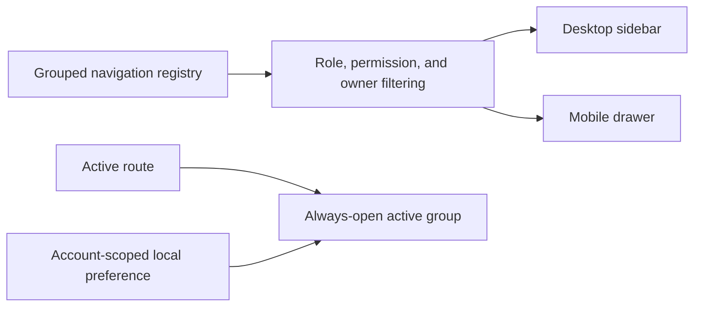
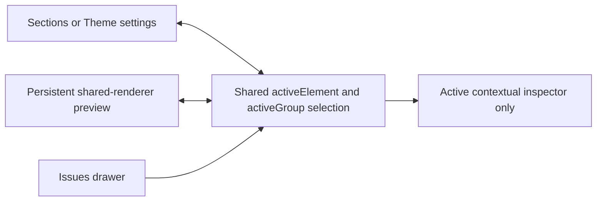
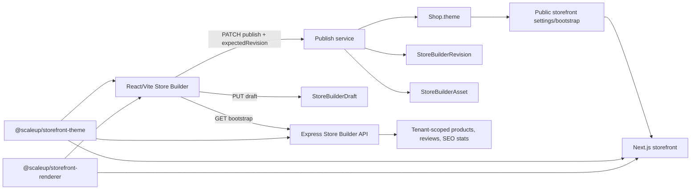

# Store Builder Architecture

## Scope And Ownership

The Store Builder edits storefront configuration owned by a `Shop`. The published source of truth remains `Shop.theme`, `Shop.customDomain`, and `Shop.storewideDiscount`. Drafts, revisions, and media ownership are separate records, so editing cannot mutate the live storefront accidentally.

The implementation intentionally uses an in-process shared React renderer instead of an iframe. Admin preview and the Next.js storefront import the same renderer package. This preserves click-to-edit integration while keeping preview and live behavior aligned.

## Vendor Admin Navigation

`ecommerce-admin/src/config/dashboardNavigation.jsx` is the single vendor navigation registry used by the responsive dashboard sidebar. Entries carry their group, route, icon, permission, feature, and owner-only metadata. Filtering happens before groups render, so a VendorStaff user never sees owner-only destinations and empty groups disappear. Backend middleware remains authoritative.

Expansion state is stored under `vendor-nav:v2:<userId>:<role>`. The active route's group is always expanded even when remembered preferences say otherwise, while manually opened groups can coexist. The same `Sidebar` instance serves desktop and the mobile drawer, avoiding separate permission logic.



## Store Builder Workspace

The Store Builder uses one shared selection to coordinate the Sections/Theme settings outline, preview highlight, contextual inspector, issue navigation, and mobile workspace tab. Dynamic sections use stable persisted IDs; indexes are used only to locate an already identified section inside the current draft.



Wide workspaces render navigation, preview, and inspector in three columns. Laptop widths keep navigation plus preview and open the inspector as a right drawer. Phone widths expose Sections, Preview, and Settings modes, and section selection moves directly to Settings. Drawers trap focus, close with Escape, and restore focus to their opener.

The fixed toolbar keeps device selection, undo, redo, live-store access, issue count, and publish visible. Draft save, published reload, version history, reset styling, and discard are in the More menu. Destructive actions require confirmation. Issues and history are drawers so they do not compress the preview.



## Shared Contracts

### Theme Contract

`packages/storefront-theme` is the authoritative framework-independent contract. It exports the schema version, fallback theme, section registry, section factory, normalization, sanitization, validation, responsive visibility, focal-point helpers, asset extraction, capability metadata, CSS variables, and change summaries.

All apps depend on this local package. Do not add a second theme default or section allowlist in an app. Compatibility fields such as `hero.imageUrl`, `hero.ctaLabel`, `hero.ctaUrl`, and `header.logoPosition` remain accepted and normalize into current behavior.

### Section Registry

Every section definition has a stable type, label, category, renderer key, defaults, editor availability, capability requirement, responsive visibility support, product/media/focal-point support, and migration aliases. The backend rejects unknown section types. Legacy types can remain renderable while unavailable for new creation.

To add a section:

1. Add one registry entry and defaults in `packages/storefront-theme/index.cjs`.
2. Add or select the renderer in `packages/storefront-renderer`.
3. Add an editor only when `editorEnabled` is true.
4. Add contract, round-trip, and renderer tests.

### Shared Renderer

`packages/storefront-renderer` owns `ReferenceStorefront` and its header, footer, homepage, all-products, section, and product-card rendering. Files under `ecommerce-storefront/src/components/storefront/reference` are compatibility re-exports. Store Builder preview imports the package directly.

Preview-only actions must be explicitly marked and must never change persisted data or production behavior. Content, color, responsive visibility, focal point, and section layout changes belong in the shared renderer.

## Theme Shape

The normalized top-level shape includes:

```text
version, logoUrl, faviconUrl, fontFamily, productGridStyle,
colors, header, typography, hero, layout, productCard,
checkoutBranding, mobile, paymentSettings, seo,
homepageSections, allProducts, migrations, navigation,
footer, policies
```

Sanitization strips unknown top-level fields, Mongo operator keys, HTML/script markup, invalid colors, and unsafe URLs. URL-like fields accept relative URLs, `https/http`, safe anchors, mail links, and telephone links. Script protocols and unsafe `data:` URLs normalize to `#`.

## Backend Data Models

### Published Shop

`Shop.themeRevision` is the optimistic-concurrency version. `lastPublishedAt` and `lastPublishedBy` identify the current published state. A publish request includes `expectedRevision`.

### StoreBuilderDraft

One tenant-scoped draft per shop stores the normalized theme, search aliases, domain, discount, base revision, draft asset IDs, and editor. Draft saves do not invalidate storefront caches or mutate `Shop.theme` or `Shop.searchAliases`.

### StoreBuilderRevision

Each successful publish or restore creates an immutable tenant-scoped snapshot with revision number, complete theme, search aliases, actor, source, change scope, optional restored revision, and change summary. `(shop_id, revision)` is unique. The service retains the newest 20 revisions; retention cleanup is non-fatal and logged for operational retry.

### StoreBuilderAsset

Uploads are registered as tenant-owned `temporary` assets with a 24-hour expiry. Draft save associates referenced assets with that draft. Publish promotes referenced assets to `active` and marks removed active assets `retired` with a seven-day grace period. Cleanup never deletes an asset still referenced by a published theme or active draft.

States are `temporary`, `active`, `retired`, `deleted`, and `failed`.

## Read, Draft, And Publish Flows

### Bootstrap

`GET /api/store-builder/admin` and `/admin/bootstrap` return one complete payload:

- shop and full normalized theme
- theme revision and publish metadata
- plan/capability metadata
- initial products plus every selected product, even beyond the first page
- categories, reviews, and selected review IDs
- full tenant SEO statistics
- persisted draft and recent revision metadata

The read path performs legacy normalization in memory and does not write to the database.

### Editor State

`StoreBuilderPage.jsx` coordinates editor composition. Focused hooks own bootstrap, autosave recovery, preview mode, dirty-state calculation, and temporary media ownership. The shell, drawers, sidebar modes, registry metadata, and advanced color editor are separate modules. State priority is:

```text
defaults -> legacy normalization -> saved theme -> current draft edits
```

Initial bootstrap hydrates saved and draft state. Background bootstrap refresh must not overwrite a dirty draft. Manual reload asks before discarding unsaved changes. Local recovery and persisted drafts are recovery mechanisms, not live storefront sources.

### Atomic Publish

`PATCH /api/store-builder/admin` performs:

1. Verify role, permission, feature, suspension, plan capabilities, and expected revision.
2. Sanitize, validate, normalize, and apply legacy compatibility.
3. Verify every managed media URL belongs to the tenant.
4. Atomically update `Shop`, create the revision, promote/retire assets, and remove the draft when Mongo transactions are available.
5. On standalone Mongo, compensate if revision or asset mutation fails.
6. Invalidate storefront settings/bootstrap and tenant-domain caches only after commit.
7. Write the immutable audit record in the same Mongo transaction when transaction support is available.

A stale request returns HTTP `409` with `code: THEME_CONFLICT`, `message`, legacy `error`, `latestRevision`, and `lastPublishedAt`. The client keeps the draft and offers reload/compare behavior.

Post-commit draft cleanup or revision-retention failures are warning codes; they do not falsely report that a committed publish failed.

### Revision Restore

Restore reads a tenant-scoped revision and publishes it as a new revision. It never rewinds or mutates revision history. The same concurrency, asset, cache, and audit rules apply.

## Endpoints And Controls

| Route | Purpose | Controls |
| --- | --- | --- |
| `GET /api/store-builder/admin` | Complete builder bootstrap | auth, VendorAdmin/VendorStaff, `storeBuilder` permission and feature |
| `PATCH /api/store-builder/admin` | Publish | above plus suspension, custom-domain feature-on-change, rate limit |
| `GET/PUT/DELETE /api/store-builder/admin/draft` | Draft recovery | tenant scope; writes are suspension guarded |
| `GET /api/store-builder/admin/revisions` | Revision timeline | tenant scope, paginated |
| `GET /api/store-builder/admin/revisions/:id` | Revision snapshot | tenant scope |
| `POST /api/store-builder/admin/revisions/:id/restore` | Publish restored snapshot | concurrency, suspension, rate limit |
| `POST /api/store-builder/admin/logo` | Logo/favicon/checkout upload | validated upload, asset registration, rate limit |
| `POST /api/store-builder/admin/image` | Theme image upload | validated upload, asset registration, rate limit |
| `DELETE /api/store-builder/admin/assets/:id` | Delete temporary media | tenant ownership; published assets rejected |
| `POST /api/store-builder/admin/seo/ai-suggest` | Homepage SEO suggestions | permission, feature, suspension, AI rate limit |
| `GET /api/store-builder/admin/seo/bootstrap` | Published SEO, SEO draft, aliases, resolved metadata, health, domain and capabilities | Store Builder permission and feature |
| `PUT/DELETE /api/store-builder/admin/seo/draft` | Save or discard only the SEO/alias scope of the shared draft | tenant scope, suspension, rate limit |
| `POST /api/store-builder/admin/seo/publish` | Atomically publish `theme.seo` and `searchAliases` | expected revision, tenant asset ownership, audit/revision transaction |
| `POST /api/store-builder/admin/custom-domain/check` | DNS verification | custom-domain feature and existing domain controls |
| `GET /api/store-builder/storefront/:subdomain` | Public theme settings | tenant resolver and public plan projection |

Custom-domain uniqueness is checked before publish and by the existing partial unique database index. The exact verified host remains authoritative for routing and SEO; do not automatically add or remove `www`.

## Upload Security

Store Builder uploads use the existing Multer/Cloudinary infrastructure with content validation. Extension and browser MIME are not trusted alone: supported image signatures are checked, and SVG uploads are rejected when they contain scripts, event handlers, foreign objects, unsafe references, or active external content. File size/count limits and route rate limits apply before asset registration.

Never accept a client-supplied Cloudinary `publicId` as ownership proof. Ownership comes from the server-created `StoreBuilderAsset` record and `shop_id`.

## Plans, Permissions, And Suspension

- Backend middleware is authoritative; sidebar locks are explanatory UX only.
- VendorStaff needs the `storeBuilder` permission.
- The shop needs the `storeBuilder` feature.
- Section and advanced-setting availability comes from plan capability metadata.
- Feature overrides cannot exceed plan capability rules.
- Verification-suspended shops cannot publish, save drafts, upload, restore, run SEO AI, or change domain verification.
- Changing a non-empty custom domain additionally requires the `customDomain` feature.

## Cache Behavior

Successful publish/restore invalidates public settings, public bootstrap variants, and tenant/domain resolution keys for affected domains. Draft save and preview do not invalidate public caches. Redis is optional; the cache service falls back when `REDIS_URL` is absent.

## Environment Variables

Store Builder integrations use:

- Backend uploads: `CLOUDINARY_CLOUD_NAME`, `CLOUDINARY_API_KEY`, `CLOUDINARY_API_SECRET`
- Backend AI: `GEMINI_API_KEY` (optional; missing configuration returns a friendly response)
- Domain verification: `CUSTOM_DOMAIN_DNS_TARGET`
- Optional distributed cache: `REDIS_URL`
- Admin DNS instructions: `VITE_CUSTOM_DOMAIN_DNS_TARGET`

Secrets stay backend-only. Never add Cloudinary secrets or `GEMINI_API_KEY` to Vite/Next public variables.

## Operations And Migration

Run temporary/retired asset cleanup from the worker and, when needed, manually:

```bash
cd ecommerce-backend/backend
npm run cleanup:store-builder-assets
```

Validate and normalize legacy themes with the migration script. Use a backup before production mutation:

```bash
cd ecommerce-backend/backend
npm run migrate:store-builder-themes
```

No destructive schema migration is required for old themes. The normalizer supplies missing fields. Rollback should deploy the prior app version while retaining the additive draft/revision/asset collections and compatibility fields; do not delete revision data during an application rollback.

## Verification

```bash
cd ecommerce-backend/backend
npm test
npm run test:mongo:up
npm run test:integration:local
npm run test:mongo:down

cd ../../ecommerce-admin
npm run lint
npm run build

cd ../ecommerce-storefront
npm run lint
npm run build

cd ..
git diff --check
```

The static contract suite checks every registered section, normalization idempotence, sanitization, compatibility, and Mongoose round-trips. Mongo-backed integration tests cover read purity, tenant isolation, complete bootstrap hydration, stale publish rejection, draft/live separation, revision restore, and asset ownership/lifecycle.

Browser E2E is not installed. Preview/live rendering shares the same package to reduce drift, but critical editor workflows still require manual QA before production deployment.

### Bundle Measurement

Using the same local Vite toolchain and the repository `HEAD` snapshot as the baseline, the Store Builder route changed from `246.32 kB` (`58.59 kB` gzip) to `65.26 kB` (`18.80 kB` gzip). The shared preview renderer is a separate `91.37 kB` (`21.60 kB` gzip) chunk loaded behind `Suspense`; Homepage SEO is a separate `20.84 kB` (`6.78 kB` gzip) route chunk. Brand/theme, colors, dynamic sections, navigation, hero, product cards, checkout, footer, and domain editors are all separate lazy chunks loaded behind local fallbacks.

## Known Boundaries

- The main coordinator is materially smaller than the previous nearly 4,000-line file and no longer contains editor-specific form markup. Its remaining shallow group dispatcher only supplies focused editor props; future work can move that prop composition into dedicated hooks without changing the editor contracts.
- Full browser automation needs an approved Playwright dependency and stable fixtures.
- Standalone Mongo receives compensation behavior, but a replica set is required for true multi-document transactions.
- Preview controls cannot prove Next.js metadata, middleware, custom-domain, or crawler behavior; those remain storefront and live-URL concerns.
