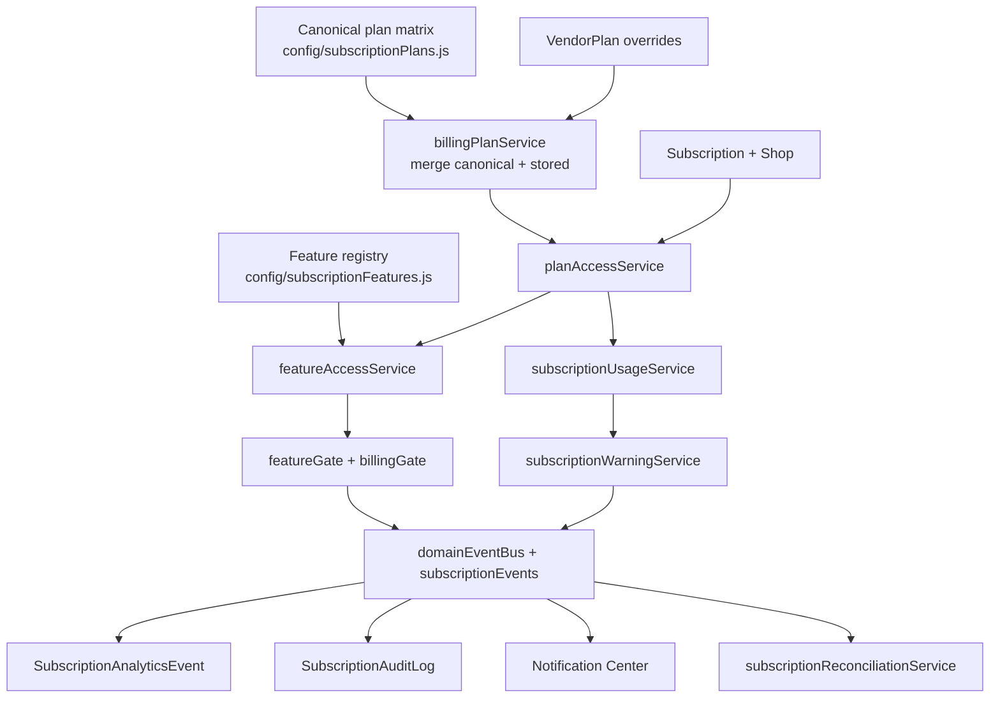
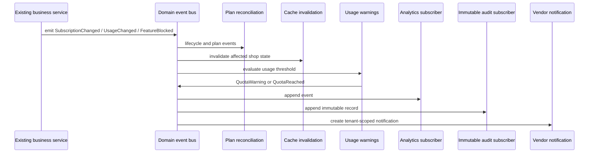

# Subscription Architecture

## Dependency Map

The subscription system remains backward compatible. Existing API paths, `Shop.plan`, `Shop.featureFlags`, `VendorPlan`, and `Subscription` documents are retained.



### Backend Consumers

| Concern | Authoritative modules | Consumers |
| --- | --- | --- |
| Plan definitions and prices | `config/subscriptionPlans.js`, `billingPlanService.js`, `VendorPlan.js` | billing controllers, public plans, invoice/payment services, Super Admin plan management |
| Feature evaluation | `config/subscriptionFeatures.js`, `featureAccessService.js`, `planAccessService.js` | `featureGate.js`, Store Builder, products, promotions, scheduled sales/products, banners, analytics/growth, badges, collections, storefront branding |
| Quotas | `subscriptionUsageService.js`, `quotaResponseService.js`, quota reservation services | products, staff, AI generation, image uploads, `/auth/me`, billing APIs |
| Lifecycle | `subscriptionService.js`, `billingLifecycleService.js`, `paymentVerificationService.js` | vendor registration, manual payment verification, Super Admin billing actions, lifecycle worker/check |
| Reconciliation | `subscriptionReconciliationService.js` | plan lifecycle event subscriber; preserves data while blocking plan-ineligible schedules/domains/badges |
| Warnings | `subscriptionWarningService.js`, `SubscriptionUsageWarning.js` | dedicated usage API, dashboard banner, Notification Center |
| Analytics | `subscriptionAnalyticsService.js`, `SubscriptionAnalyticsEvent.js` | domain-event subscriber, Super Admin analytics API |
| Audit timeline | `subscriptionAuditService.js`, `SubscriptionAuditLog.js` | domain-event subscriber, Vendor Admin and Super Admin timeline APIs |

### Frontend Consumers

- `ecommerce-admin/src/utils/featureAccess.js` consumes backend `effectiveFeatures` and `planAccess.featureStatuses`; it is UX only.
- Sidebar and protected admin routes use those values to explain unavailable modules. Backend gates remain authoritative.
- Vendor Billing consumes the shared usage payload and immutable timeline.
- Dashboard `SubscriptionUsageBanner` consumes `GET /api/vendor/billing/usage`.
- Super Admin Billing consumes the same audit timeline service through its platform-scoped endpoint.
- Storefront receives only public decisions such as `showPlatformBranding`; it does not receive plan internals.

## Feature Evaluation

`FEATURE_REGISTRY` is the only list of subscription capabilities. Each entry defines its key, label, minimum recommended plan, optional shop override key, aliases, or Store Builder capability source.

Evaluation order:

1. Resolve the active subscription and merged plan.
2. Require an active/approved shop and operational subscription status.
3. Read the plan value from the registry definition.
4. Apply a shop override only as an explicit disable.
5. Return a structured status with `enabled`, `reason`, `planAllowed`, `shopOverride`, and upgrade guidance.

An override can disable an included plan feature. It cannot enable a feature excluded by the plan.

## Usage API

`GET /api/vendor/billing/usage` and the compatibility route `GET /api/admin/billing/usage` return:

```json
{
  "success": true,
  "plan": "Growth",
  "planKey": "growth",
  "subscriptionStatus": "active",
  "usage": {
    "products": { "used": 210, "limit": 500, "remaining": 290, "unlimited": false },
    "staff": { "used": 2, "limit": 3, "remaining": 1, "unlimited": false },
    "aiGeneration": { "used": 18, "limit": 50, "remaining": 32, "unlimited": false, "resetsAt": "..." },
    "imagesPerProduct": 10
  },
  "warnings": []
}
```

`/auth/me` and `/api/admin/billing/current` call the same service. Legacy usage fields remain in those responses during frontend migration.

Usage is calculated in parallel from tenant-scoped product, active staff, and weekly AI records. It is intentionally not long-lived cached because it is used for upgrade decisions and warning boundaries. Feature/plan caches are invalidated by lifecycle events.

## Warnings And Quotas

Thresholds come from `SUBSCRIPTION_USAGE_WARNING_THRESHOLDS` and default to `80,90,100`. Crossing state is persisted by shop, resource, plan/limit scope, and threshold. Dropping below a threshold resets only that warning state; immutable audit and analytics events remain.

Quota failures use one payload from `quotaResponseService`, including a resource-specific `errorCode`, plan, structured usage, and upgrade recommendation. Existing `code`, `limit`, `current`, `limitKey`, and `upgradePlan` fields remain available temporarily.

## Event Flow



Subscribers are named and priority ordered. New email, webhook, or data-warehouse listeners can be registered without modifying subscription business services.

## Analytics Schema

`SubscriptionAnalyticsEvent` is append-only and stores unique `eventId`, tenant/shop, plan, normalized analytics event type, original domain event type, actor ID, correlation ID, safe metadata, and occurrence time. Indexes support shop/event/time and platform event/time queries.

Tracked events include AI generation, product creation, product limit reached, staff changes, upgrade clicks/success, downgrade, feature blocks, trials, renewals, quota warnings, and subscription changes.

## Audit Schema

`SubscriptionAuditLog` is append-only and rejects update, replace, delete, and subsequent document save operations. It stores unique event ID, timestamp, actor, target shop/tenant/subscription, old/new values, reason, request/IP/user-agent context, affected resources, request ID, and correlation ID.

Vendor responses omit actor email, IP address, and user agent. Super Admin can filter by shop, event type, actor role, correlation ID, search text, and dates. Both views use `subscriptionAuditService` and the shared pagination contract.

## APIs

- `GET /api/vendor/billing/usage`
- `GET /api/admin/billing/usage` (compatibility)
- `GET /api/admin/billing/timeline`
- `POST /api/admin/billing/events/upgrade-clicked`
- `GET /api/super-admin/subscription-timeline`
- `GET /api/super-admin/subscription-analytics`

No existing route was removed or renamed.

## Deployment And Migration

No shop/subscription data migration is required. Mongoose creates indexes for the three new append/state collections. Existing themes, feature overrides, plans, invoices, subscriptions, and usage records remain valid.

Before production deployment:

1. Back up `vendorplans`, `subscriptions`, and `shops`.
2. Run `node scripts/sync-subscription-plans.js --dry-run`.
3. Run `npm run sync:plans` after review so stored plans contain the latest registry-backed fields.
4. Set `SUBSCRIPTION_USAGE_WARNING_THRESHOLDS` only if the default `80,90,100` policy should change.

Historical lifecycle actions are not fabricated or backfilled into the immutable timeline. The timeline starts recording when this architecture is deployed.

## Extension Points

- Add a registry entry and canonical plan values to introduce a feature.
- Add a quota resource definition and usage provider without changing controllers.
- Subscribe an email or webhook listener to warning/lifecycle events.
- Build cohort/churn dashboards over `SubscriptionAnalyticsEvent`.
- Add an export worker over `SubscriptionAuditLog` without weakening tenant filters.
